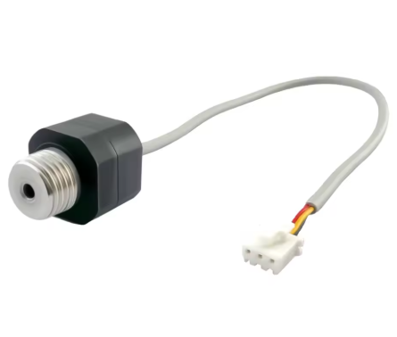
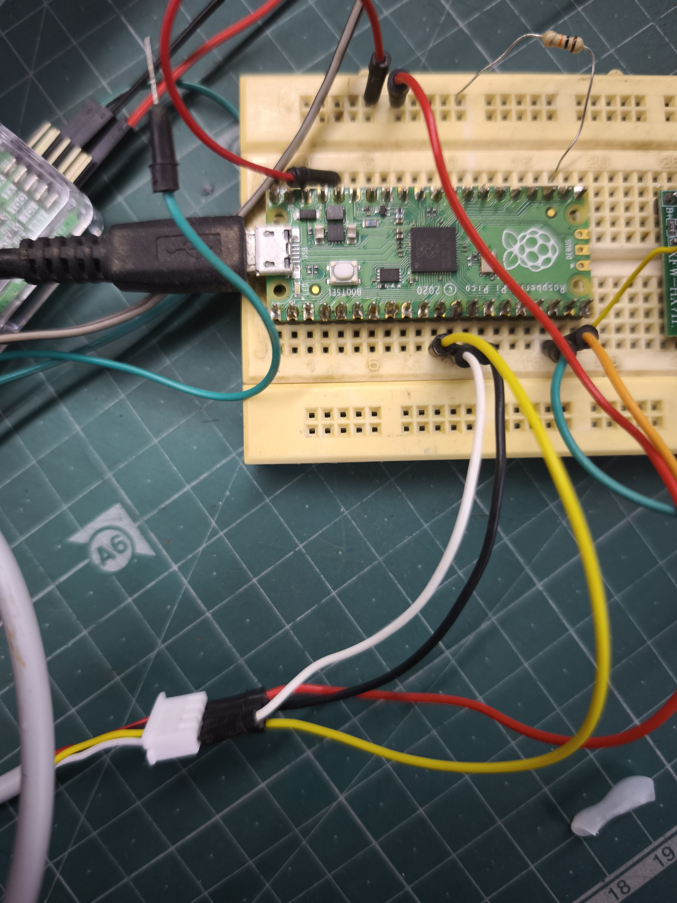
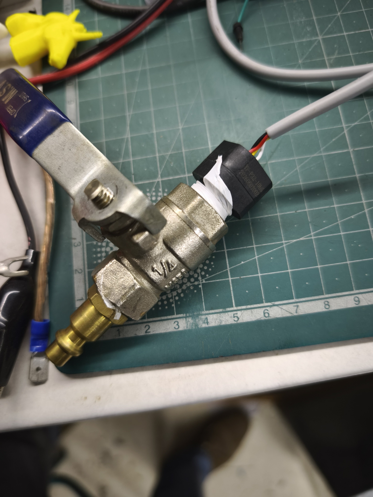

# YF-P32-10bS pressure sensor
This is a 0-10bar (1 MPa) pressure sensor with an I2C (IIC) interface. There is little to no documentation available for this sensor at the time this project was created (June 2026).

This project has some simple Raspberry Pi Pico C code to scan the I2C bus to see attached devices - if you've wired this up correctly, you'll see the device appear at 0x58.  The code lays out the read & conversion procedure to read the data from the sensor over the I2C bus.

## Reading the pressure

1. Write 0x01 to register 0x01  — starts ASIC acquisition
2. Wait 10 ms
3. Write register address 0x04, repeated-start, read 3 bytes
4. RAW_P  = Byte1*65536 + Byte2*256 + Byte3
5. Inter_P = (RAW_P > 8388608) ? RAW_P - 16777216 : RAW_P
6. P (kPa) = Inter_P / 2^21 * RANGE_KPA + ZERO_KPA

This is from a very simple datasheet sent to me by the merchant, and summarised into code by Github Copilot.

## Wiring

|Pico GPIO|Pico physical pin|Function|Sensor wire|
|-|-|-|-|
|GPIO 8|11|SDA|Yello|
|GPIO 9|12|SCL|White|

For testing at 100kHz I2C, you can use the RP2040's internal pullups.

